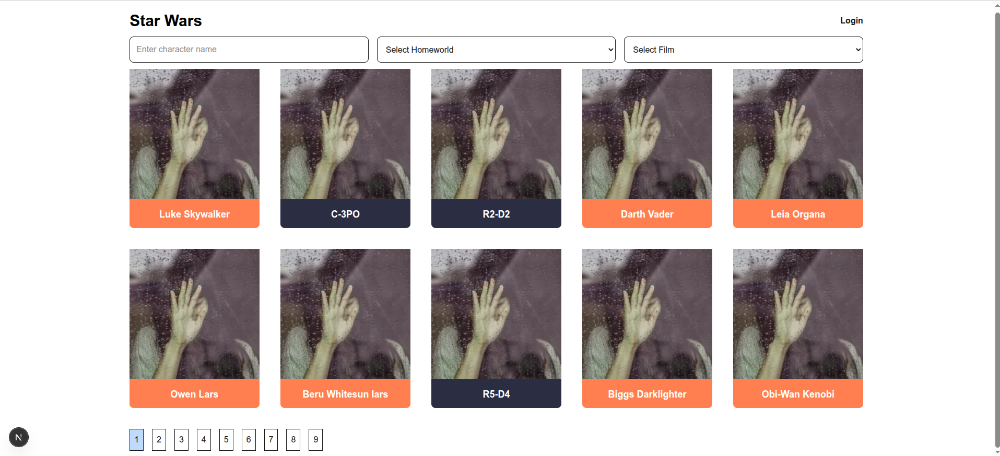
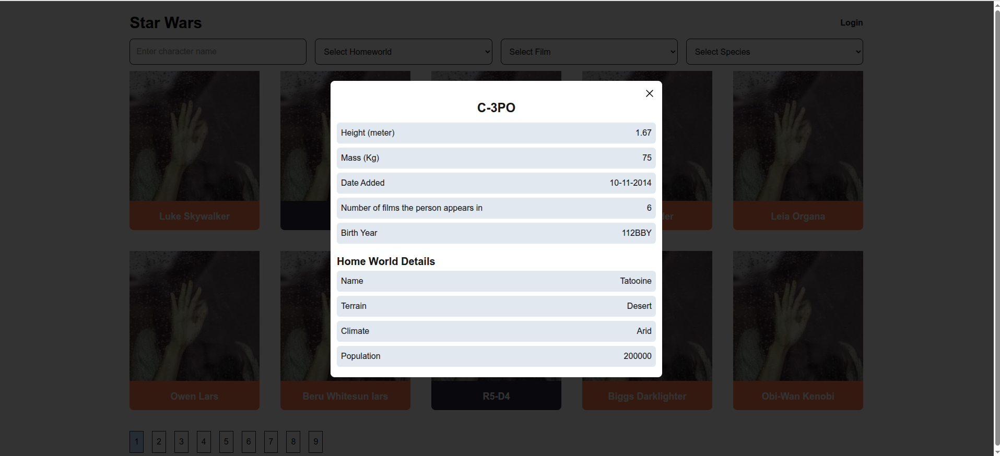
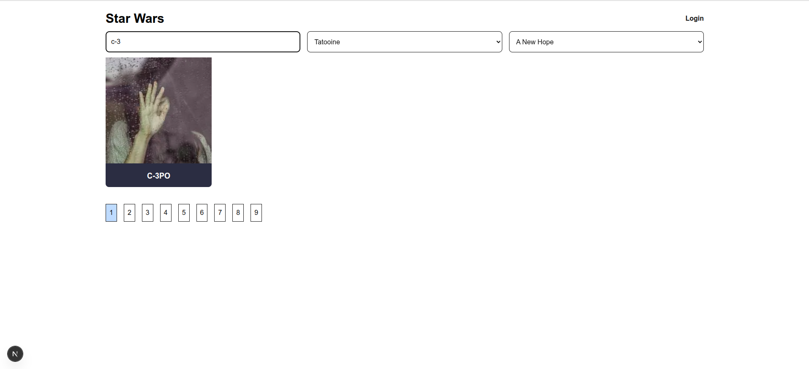
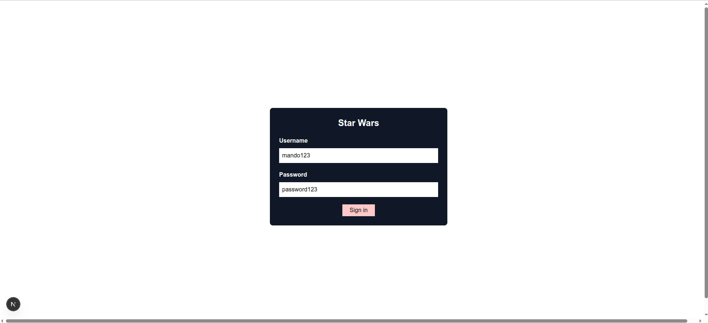
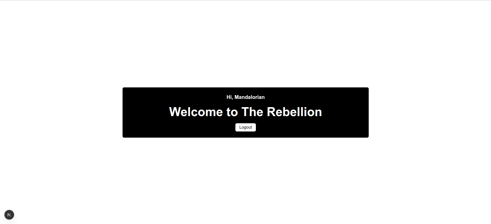

# Star Wars Character App

### How to run project.
Follow the steps to run the project:
1. Open the terminal
2. Clone this repository using the follwing command: git clone https://github.com/thakurhimself/star-wars-characters.git swc
2. cd swc
3. Run the following command for production build: npm run build
4. npm start

Note - It is recommended that you run the production build which is working perfectly. Developement build is showing unexpected behaviour perhaps because of the recently released version of NextJS version 16.

### Features Implemented
Following features have been implemented:
1. Fetch and display characters.
    * Used /people endpoint to fetch list of characters with pagination
    * Implemented loading and error states for different outcomes of network call.
    

2. Character cards features.
    * Card shows name and a random image (fetched from lorem picsum) (see above image). 
    * Each card has distinct background color based on species (see above image)

3. Character details: In modal character details are shown including name, heigh (in meters), mass (in kg), date added, number of films the person appears in, birth year, homeworld details.
    

4. Responsive for mobile, tablet, and desktop screens.

Bonus Features:
5. Allow search by character name.
6. Filter by homeword and film.
7. combination of character name search and homeworld and film filters.
    

8. Mock Authentication:
    * Simple login/logout feature with mocked jwt token.
    * Silent token refresh logic.
    
    

### Trade-offs and design choices
1. 

